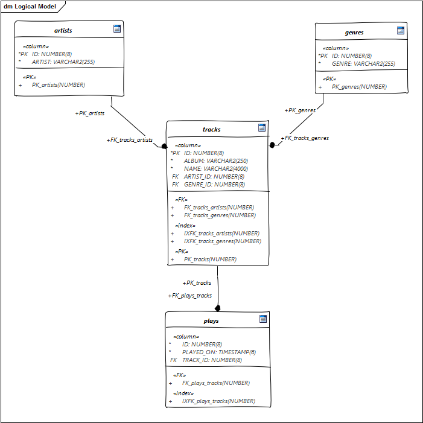
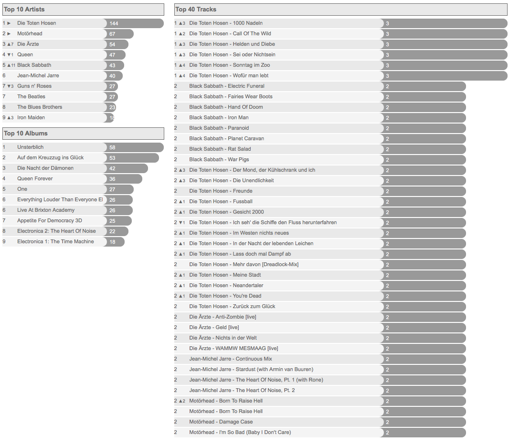
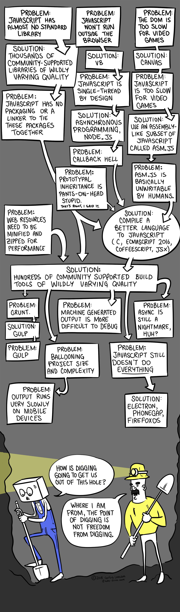
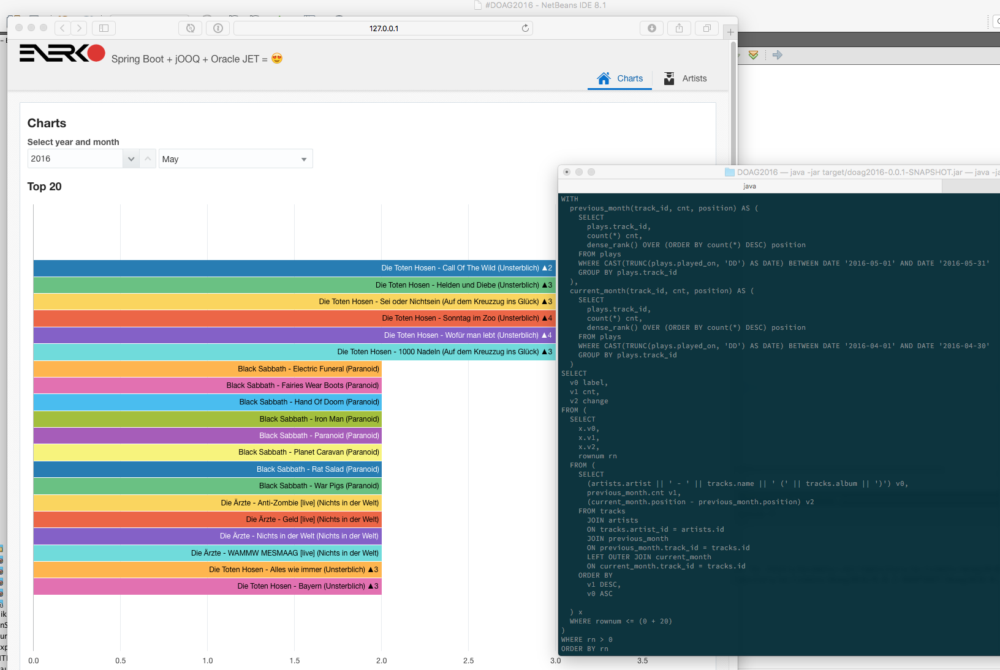

= Datenbankzentrische Anwendungen mit Spring Boot und jOOQ
:author: Michael J. Simons
:email:  michael@simons.ac
:lang: de
:revdate: 2016-09-21
:doctype: article
:toc:
:toclevels: 1
:source-highlighter: prettify
ifdef::backend-pdf[]
:source-highlighter: rouge
endif::[]
:keywords: Spring Boot, jOOQ, Oracle JET, Flyway, SQL, NetBeans, Docker

== Stichworte

{keywords}

== Einleitung

In diesem Vortrag wird eine Variante datenbankzentrischer Anwendungen mit einer modernen Architektur vorgestellt, die sowohl in einer klassischen Verteilung als auch "cloud native" genutzt werden kann und dabei eine sehr direkte Interaktion mit Datenbanken erlaubt.

jOOQ ist eine von vielen Möglichkeiten, Datenbankzugriff in Java zu realisieren, aber weder eine Objektrelationale Abbildung (ORM) noch "Plain SQL", sondern eine typsichere Umsetzung aktueller SQL Standards in Java. jOOQ "schützt" den Entwickler nicht vor SQL Code, sondern unterstützt ihn dabei, typsicher Abfragen in Java zu schreiben.

Spring Boot setzt seit 2 Jahren neue Standards im Bereich der Anwendungsentwicklung mit dem Spring Framework. Waren vor wenigen Jahren noch aufwändige XML Konfigurationen notwendig, ersetzen heute "opinionated defaults" manuelle Konfiguration. Eine vollständige Spring Boot Anwendung passt mittlerweile in einen Tweet.

Viele bestehende System lassen sich nicht ohne größere Schmerzen in die schöne, neue Welt aus Microservices überführen, sei es aus menschlichen oder technischen Gründen.

Vor 15 Jahren war es erheblich einfacher als heute, einen "Fullstack Developer" zu finden, aber wie oft wurde in den vergangenen 2 bis 5 Jahren Jahren das Einhorn gesichtet, dass sowohl mit komplexen Datenbankschemata und Abfragen als auch mit dem gerade aktuellen JavaScript Framework für das Frontend auskennt?

Da nach wie vor in großen Anwendungen Datenstrukturen und Daten die am wenigsten oft ausgetauschten Komponenten eines System wird in diesen System die Datenbank integrierender Bestandteil sein. Es wäre fatal, Wissen über die Daten, Zugriffsmethoden und Abfragen "verkommen" zu
lassen.

<<<

== Das Beispiel

Seit 2002 gibt es das https://de.wikipedia.org/wiki/Last.fm[Last.fm] Portal. Dort konnte und kann man Musik "scrobbeln". Als Scrobbeln bezeichnet man die Speicherung von Interpret, Album und Titel eines gerade gehörten Musikstückes. Auf meinem täglichen Fotoprojekt https://dailyfratze.de[Daily Fratze] habe ich seit 2005 eine ähnliche Funktion implementiert. Das Datenmodel ist seitdem konstant gewesen:

Nicht kompliziert, eher einfach, aber vollkommen ausreichend. Das Datenmodel ist sogar eines, das sich sehr leicht in eine Objektrelationale Abbildung übersetzen lässt, aber kann man damit dann dieses Ergebnis in weniger als 5 SQL Statements erzeugen?

Man kann. Die Daten der drei Charts werden jeweils mit einem MySQL Statement selektiert, das im Gegensatz zum Datenbankmodel furchtbar kompliziert ist und trotz Hibernate als Native Query hinterlegt ist.

Das Ziel ist nun, diese Daten so über die Datenbank bereitzustellen, dass

* das Selectstatement verständlich bleibt ("Modern SQL")
* das Statement während der Kompilierung überprüft wird
* die erzeugten Daten nicht ans Frontend gekoppelt sind

<<<

== Spring Boot

----
  .   ____          _            __ _ _
 /\\ / ___'_ __ _ _(_)_ __  __ _ \ \ \ \
( ( )\___ | '_ | '_| | '_ \/ _` | \ \ \ \
 \\/  ___)| |_)| | | | | || (_| |  ) ) ) )
  '  |____| .__|_| |_|_| |_\__, | / / / /
 =========|_|==============|___/=/_/_/_/
 :: Spring Boot ::        (v1.4.1.RELEASE)
----

=== Was ist Spring Boot?

Spring Boot ist kein neues Framework. Spring Boot bedient sich des bekannten und bewährten Spring Frameworks und des darum entstandenen Ökosystems, um "fertig konfigurierte Instanzen" des Frameworks als autonome, self-contained Anwendungen zu erzeugen.

Spring Boot selber besteht im wesentliche aus sogenannten https://github.com/spring-projects/spring-boot/tree/master/spring-boot-starters[spring-boot-starters], die die für den jeweiligen Zweck nötigen Konfigurationsklassen und Abhängigkeiten beinhalten.

Auch für jOOQ gibt es einen passenden https://github.com/spring-projects/spring-boot/tree/master/spring-boot-starters/spring-boot-starter-jooq[Starter].

=== Eine neue Spring Boot Anwendung anlegen

Eine vollständige Anwendung kann in wenigen Augenblicken erstellt bzw. generiert werden. Entweder kann manuell ein Buildfile (entweder für https://maven.apache.org[Maven] oder https://gradle.org[Gradle]) geschrieben oder ein vollständiges Projekt über den Spring Initializer unter http://start.spring.io[start.spring.io] generiert werden:

[source, xml]
----
<?xml version="1.0" encoding="UTF-8"?>
<project>
    <modelVersion>4.0.0</modelVersion>

    <groupId>ac.simons</groupId>
    <artifactId>doag2016</artifactId>
    <version>0.0.1-SNAPSHOT</version>
    <packaging>jar</packaging>

    <name>#DOAG2016</name>

    <parent>
        <groupId>org.springframework.boot</groupId>
        <artifactId>spring-boot-starter-parent</artifactId>
        <version>1.4.0.RELEASE</version>
        <relativePath/> <!-- lookup parent from repository -->
    </parent>

    <properties>
        <project.build.sourceEncoding>UTF-8</project.build.sourceEncoding>
        <project.reporting.outputEncoding>UTF-8</project.reporting.outputEncoding>
        <java.version>1.8</java.version>
    </properties>

    <dependencies>
        <dependency>
            <groupId>org.springframework.boot</groupId>
            <artifactId>spring-boot-starter-jooq</artifactId>
        </dependency>
        <dependency>
            <groupId>org.springframework.boot</groupId>
            <artifactId>spring-boot-starter-web</artifactId>
        </dependency>
        <dependency>
            <groupId>org.springframework.boot</groupId>
            <artifactId>spring-boot-devtools</artifactId>
            <optional>true</optional>
        </dependency>

        <dependency>
            <groupId>com.h2database</groupId>
            <artifactId>h2</artifactId>
            <scope>runtime</scope>
        </dependency>
    </dependencies>

    <build>
        <plugins>
            <plugin>
                <groupId>org.springframework.boot</groupId>
                <artifactId>spring-boot-maven-plugin</artifactId>
            </plugin>
        </plugins>
    </build>
</project>
----

Zusammen mit dieser Klasse ist eine vollständige Java Anwendung fertig, inklusive einer konfigurierten In-Memory Datenbank:

[source, java]
----
package ac.simons.doag2016;

import org.springframework.boot.SpringApplication;
import org.springframework.boot.autoconfigure.SpringBootApplication;

@SpringBootApplication
public class Application {

    public static void main(String... args) {
        SpringApplication.run(Application.class, args);
    }
}
----

Das entstehende "fat jar" ist knapp 18Mb groß, beinhaltet aber bereits ein eingebetteten Tomcat als Servletcontainer sowie das Spring Framework.

=== Fazit

Mit Spring Boot wird das Spring Framework extrem zugänglich. Sowohl für Entwickler, die sich sehr lange nicht im Java Umfeld bewegt, zum Beispiel lange im Bereich PL/SQL oder Forms Entwicklung tätig waren, als auch für Menschen, die noch nicht lange im Alltag mit Softwareentwicklung zu tun haben.

Da der Fokus nicht mehr auf einer aufwändigen Konfiguration liegt, kann man sich auf interessante Fragen konzentrieren: Auf Fachlichkeit, Softwarearchitektur, Datenstrukturen oder auch darauf, modernes Java oder SQL zu lernen!

<<<

== jOOQ

=== Was ist jOOQ?

Obiges Datenmodel kann mit wenigen Zeilen Code auf JPA Entitäten abgebildet werden. Möchte ich dann aber eine Abfrage erstellen, die sowohl eine _Common Table Expression_ (CTE) als auch mehrere Windowfunctions enthält, funktioniert das garantiert nicht mit der _JPA Query Language_ (JPQL), höchsten mit nativen Queries und aus dieser Query

[source, sql]
----
WITH
  previous_month AS
   (SELECT p.track_id, count(*) as cnt,
           dense_rank() over(order by count(*) desc) as position
      FROM plays p
     WHERE trunc(p.played_on, 'DD') between date'2016-04-01' and date'2016-04-30' GROUP BY p.track_id),
  current_month AS
   (SELECT p.track_id, count(*) as cnt,
           dense_rank() over(order by count(*) desc) as position
      FROM plays p
    WHERE trunc(p.played_on, 'DD') between date'2016-05-01' and date'2016-05-31' GROUP BY p.track_id)
SELECT a.artist || ' - ' || t.name || ' (' || t.album || ')' as label,
       current_month.cnt,
       previous_month.position - current_month.position as change
  FROM tracks t
  JOIN artists a on a.id = t.artist_id
  JOIN current_month current_month on current_month.track_id = t.id
  LEFT OUTER join previous_month on previous_month.track_id = t.id
 ORDER BY current_month.cnt desc, label asc
 FETCH FIRST 20 ROWS ONLY;
----

Eine Möglichkeit, diese Abfrage in JPA / Hibernate abzubilden:

[source, java]
----
@Entity
@SqlResultSetMapping(
        name = "ChartMapping",
        columns = {
            @ColumnResult(name = "label", type = String.class),
            @ColumnResult(name = "cnt", type = Integer.class),
            @ColumnResult(name = "chage", type = Integer.class)
        })
@NamedNativeQueries(
        @NamedNativeQuery(
                name = "ChartQuery",
                resultSetMapping = "ChartMapping",
                query = ""
                + "WITH \n"
                + "  previous_month AS\n"
                + "   (SELECT p.track_id, count(*) as cnt, \n"
                + "           dense_rank() over(order by count(*) desc) as position  \n"
                + "      FROM plays p \n"
                + "     WHERE trunc(p.played_on, 'DD') between date'2016-04-01' and date'2016-04-30' GROUP BY p.track_id),\n"
                + "  current_month AS\n"
                + "   (SELECT p.track_id, count(*) as cnt, \n"
                + "           dense_rank() over(order by count(*) desc) as position \n"
                + "      FROM plays p \n"
                + "    WHERE trunc(p.played_on, 'DD') between date'2016-05-01' and date'2016-05-31' GROUP BY p.track_id)\n"
                + "SELECT a.artist || ' - ' || t.name || ' (' || t.album || ')' as label,\n"
                + "       current_month.cnt,  \n"
                + "       previous_month.position - current_month.position as change\n"
                + "  FROM tracks t\n"
                + "  JOIN artists a on a.id = t.artist_id\n"
                + "  JOIN current_month current_month on current_month.track_id = t.id\n"
                + "  LEFT OUTER join previous_month on previous_month.track_id = t.id\n"
                + " ORDER BY current_month.cnt desc, label asc"
        )
)
public class PlayEntity {
    public static void main(String... a) {
        // Don't do this at home
        EntityManager entityManager;
        List<Object[]> results = entityManager.createNamedQuery("ChartQuery").setMaxResults(20).getResultList();
        results.stream().forEach((record) -> {
            String label = (String) record[0];
            Integer cnt = (Integer) record[1];
            Integer change = (Integer) record[2];
        });
    }
}
----

SQL love no more…

Das Ziel von jOOQ ist nicht, obigen SQL Code zu verstecken, im Gegenteil. jOOQ ist in erster Linie ein Codegenerator, aus dem Datenbankschema Zugriffsklassen für eine _Domain Specific Language_ (DSL) generiert. Diese DSL beinhaltet in erster Linie nur die Fachlichkeit, die durch das Datenmodel vorgeben ist und keine Architekturvorgabe. Ihr Ziel ist es, SQL zu schreiben. Obige Abfrage typsicher mit jOOQ, keine Annotationen:

[source, java]
----
this.create
        .with(currentMonth)
        .with(previousMonth)
        .select(label,
                currentMonth.field("cnt"),
                previousMonth.field("position").minus(
                    currentMonth.field("position")
                ).as("change")
        )
        .from(TRACKS)
        .join(ARTISTS).onKey()
        .join(currentMonth).on(currentMonth.field("track_id", BigDecimal.class).eq(TRACKS.ID))
        .leftOuterJoin(previousMonth).on(previousMonth.field("track_id", BigDecimal.class).eq(TRACKS.ID))
        .orderBy(currentMonth.field("cnt").desc(), label.asc())
        .limit(n)
        .fetch()
        .formatJSON(response.getOutputStream());
----

=== Architekturstil

jOOQ zielt im Auge des Autors auf eine SQL-basierte 2-Schichtenarchitektur. Es ist möglich, das Repository-Muster anzuwenden, aber die Erfahrung spricht dagegen.

jOOQ spielt seine Stärken dann aus, wenn es um die Modellierung komplexer Abfrage geht, nicht in möglichst hoher Abstraktion.

=== jOOQ im Buildprozess

jOOQ wird in einem frühen Stadium in den Buildprozess eingebunden, im Falle von Maven in der `generate-sources` Phase. Es kann konfiguriert werden, welche Datenbankobjekte (jOOQ unterstützt Tabellen, Prozeduren, Funktionen, Packages und mehr) betrachtet werden, welches Zielverzeichnis genutzt wird und welche zusätzliche POJOs und Dataaccess Objekte generiert werden.

Kann man auf der "grünen Wiese" anfangen oder hat generell die Möglichkeit, Hilfsmittel zur Datenbankmigration anzuwenden, kann zum Beispiel dem Generierungsprozess eine Migration mit Flyway vorgeschaltet werden.

Flyway wird ebenfalls von Spring Boot unterstützt, so dass eine konsistente Version von Entwicklungs- und Produktionsdatenbank sichergestellt werden kann.

=== jOOQ und Spring Boot

Obiges Projekt funktioniert ohne weiteres zutun mit den im Buildprozess generierten Klassen. Die in Spring Boot konfigurierte Datenbankverbindung wird automatisch einem jOOQ Connection Provider zur Verfügung gestellt.

Weitere, sehr detaillierte Konfiguration ist problemlos möglich:

[source, java]
----
@Bean
public org.jooq.Configuration jooqConfig(
        final ConnectionProvider connectionProvider,
        final TransactionProvider transactionProvider,
        final ExecuteListenerProvider executeListenerProvider,
        @Value("${jooq.renderFormatted:false}") final boolean renderFormatted
) {
    final DefaultConfiguration hlp = new DefaultConfiguration();
    return hlp
            .derive(hlp.settings()
                    .withRenderNameStyle(RenderNameStyle.LOWER)
                    .withRenderKeywordStyle(RenderKeywordStyle.UPPER)
                    .withRenderFormatted(renderFormatted)
            )
            .derive(connectionProvider)
            .derive(transactionProvider)
            .derive(executeListenerProvider)
            .derive(SQLDialect.ORACLE);
}
----

=== Kommerzieller Einsatz von jOOQ

jOOQ ist kostenfrei nutzbar mit OpenSource Datenbanken unter Apache Software License 2.0. Für den Einsatz mit kommerziellen Datenbanken stehen verschiedene, kommerzielle http://www.jooq.org/legal/licensing#databases[Lizenzen] zur Verfügung.

In der Demo zum Vortrag wird eine Oracle Database Enterprise Edition genutzt. Damit die Demo gestartet werden kann, muss vor dem Build eine Trialversion der jOOQ Professional Edition im lokalen Maven Repository installiert werden.

=== Fazit

jOOQ ist mit Spring Boot quasi trivial verwendbar: Sowohl die notwendige Codegenerierung im Buildprozess als auch das Bootstrapping des jOOQ Kontextes passen in das Entwicklungsmodel von Spring Boot.

Akzeptiert man eine zweischichtige Architektur kann man sehr leicht vorhandenes Wissen im Bereich Datenbankmodellierung und Abfrage in moderne Softwareentwicklung bringen. Innerhalb einer Spring Boot Anwendung kann jOOQ nahezu in beliebige Cloudumgebungen deployed werden.

jOOQ passt - wie viele andere Werkzeuge auch - nicht auf jeden Anwendungsfall. Liegt ein _Domain Driven Design_ Ansatz vor, sind komplexe Abfragen nicht maßgeblicher Bestandteil einer Anwendung oder ist der Schreibzugriff wichtiger, sprechen viele gute Gründe für den Einsatz eines ORMs wie JPA / Hibernate, gerne auch zusammen mit http://projects.spring.io/spring-data-jpa/[Spring Data JPA]. Ein hier skizzierter Anwendungsfall, quasi eine direkte Abbildung einer HTTP Abfrage auf eine komplexe Query, lässt sich allerdings hervorragend mit jOOQ abbilden.

<<<

== Oracle JET

=== Das JavaScript Frontend Dilemma

Der Schwerpunkt dieses Vortrages liegt nicht auf dem Frontend, aber die besten Daten sind nur schlecht erfassbar ohne ansprechende Präsentation. Viele moderne Anwendungen werden "headless" betrieben, ohne ein auf dem Server generiertes Webfrontend. Wird eine UI erstellt, so führt 2016 kaum noch ein Weg um JavaScript und allem was dazu gehört, vorbei. Mit einer schonungslosen Ausdauer werden Probleme gelöst:

Aus diesem Dilemma gibt es mehrere Auswege: Man wählt ein Komponentenframework wie eine beliebige JSF Implementierung, GWT oder Vaadin, das auf Seiten des Servers HTML und JavaScript Komponenten erzeugt. Solange man keine speziellen Anpassungen benötigt, wird der Entwickler gut bis sehr gut vor den "Schmerzen" obigen Bildes geschützt. Ganz schnell läuft man aber Gefahr, dass scheinbar einfache Kundenanforderungen so sehr in den generierten Clientcode eingreifen, dass die hohe Abstraktion mehr schadet als nutzt.

Ein anderer Ausweg bietet die Zusammenstellung eigener Sammlungen von Komponenten oder der Entwurf eigener Frameworks (vermutlich die Quelle vieler auf *.js endender Frameworks). In beiden Fällen läuft man Gefahr, vom Wartungsaufwand überrannt zu werden.

=== Oracles Lösung

Oracle JET, kurz für _JavaScript Extension Toolkit_, wählt genau den Ansatz intelligent zusammengestellter Komponenten, um Entwicklern eine Sammlung von Werkzeugen zur Verfügung zu stellen, um modulare Anwendungen auf Basis moderner JavaScript, CSS3 und HTML5 Prinzipien zur Verfügung zu stellen.

Das Ziel der Demo war, die über jOOQ / SQL selektierten mit Spring Boot einem Frontend zur Verfügung zu stellen und dort darzustellen:

* Als Balkendiagram
* Als kumulatives Liniendiagram
* Mit ansprechender, zugänglicher Eingabemöglichkeit für Parameter
* Grundsätzlich Internationalisierbar

Mit dem http://www.oracle.com/webfolder/technetwork/jet/jetCookbook.html[Oracle JET Cookbook] war das tatsächlich kein Problem, innerhalb weniger https://twitter.com/OracleJET/status/774269763249930240[Tage] konnte die Anwendung umgesetzt werden.

Laut eigener Aussage zielt Oracle mit dem JET Framework auf "intermediate to advanced JavaScript developers". Mit grundsätzlich vorhandenem Wissen zu JavaScript, jQuery und der MVVM Implementierung http://knockoutjs.com[KnockoutJS] gelang es, obige Anforderungen an die Demo einfach umzusetzen:

=== Fazit

Die Demo ist eine hübsche Spielerei, beinhaltet aber viele Dinge, die im Geschäftsalltag benötigt werden. Die Technologie ist zugänglich und nach erster Einschätzung auch Zukunftssicher, findet man sie doch bereits in Teilen in Oracle Apex wieder.

Eine deutlich ausführlichere Beschreibung von Oracle JET von http://multikoop.blogspot.de[Andreas Koop] steht auf den DOAG Seiten zur Verfügung: http://www.doag.org/home/aktuelle-news/article/moderne-html5-anwendungen-mit-oracle-jet-entwickeln.html[Moderne HTML5-Anwendungen mit Oracle JET entwickeln].

== Spring Boot, jOOQ und Oracle Jet: Fazit

Steht man vor der Entscheidung, neue Produkte auf Basis bestehender, großer Datenmodelle zu Entwicklen und gegebenenfalls Rücksicht auf alte Anwendungen nehmen zu müssen, ist der hier vorgestellte Stack eine Möglichkeit, vorhandenes Wissen über SQL und Datenbanken mit auf eine moderne Plattform zu nehmen und mit einem ansprechenden Frontend zu versehen.

== NetBeans

Die offizielle, offene und freie Java IDE https://netbeans.org[NetBeans] bietet per se exzellentes Javatooling, offizielle Plugins für die Entwicklung von Oracle JET Anwendungen sowie Unterstützung für Spring Boot. Einen ersten Einstieg nach dieser Demo bietet der Vortrag https://github.com/michael-simons/NetBeansEveningCologne[NetBeans, Maven und Spring Boot …mehr Spaß zusammen].

<<<

== Bonus: Oracle Docker Images und Maven Repository

=== Oracle Datenbank für Docker

Oracle stellt seit 2016 offizielle Skripte zur Erzeugung von Images für Docker zur Verfügung: https://github.com/oracle/docker-images/tree/master/OracleDatabase[Oracles docker images repository]. Diese Skripte sind gleichermaßen unter OS X, Windows 10 und Linux lauffähig und machen es sehr einfache, lokale Datenbanken zu Entwicklungszwecken, Testen oder ähnlichem zu Erzeugen. Die Demo beinhaltet mehrere Schritte, in denen gezeigt wird, wie die Skripte zur Verwenden sind.

=== Offizielle Maven Koordinaten für den Oracle JDBC Treiber

Oracles JDBC Treiber ist nach wie vor nicht im _central repository_ verfügbar. Allerdings steht seit einiger Zeit ein offizielles Oracle Repository zur Verfügung, das mit wenig Vorarbeit genutzt werden kann, so dass nicht in eigenen Repositories eine parallel Installation des JDBC Treibers gepflegt werden muss. Die Demo zeigt die Verwendung des Oracle Repositories, Oracle JDBC steht unter

[source, xml]
----
<dependency>
    <groupId>com.oracle.jdbc</groupId>
    <artifactId>ojdbc7</artifactId>
</dependency>
<dependency>
    <groupId>com.oracle.jdbc</groupId>
    <artifactId>orai18n</artifactId>
</dependency>
----

zur Verfügung.

== Ressourcen

* http://projects.spring.io/spring-boot/[Spring Boot]
* http://www.jooq.org[jOOQ], 
* https://flywaydb.org[Flyway]
* https://modern-sql.com[SQL],
* http://www.oracle.com/webfolder/technetwork/jet/index.html[Oracle JET]
* https://netbeans.org[NetBeans]
* https://www.docker.com[Docker]

== Kontakt

{author} +
http://michael-simons.eu[michael-simons.eu] +
https://twitter.com/@rotnroll666[@rotnroll666] +
mailto:{email}[{email}] +

ENERKO INFORMATIK GmbH +
Markt 45-47 +
52062 Aachen Germany